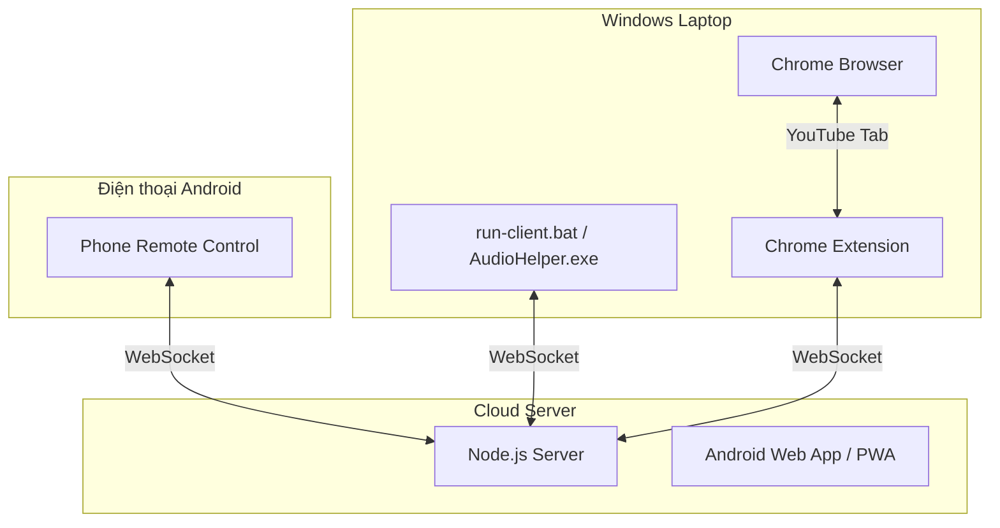

# 🎵 YouTube & Windows Audio Remote Controller (Cloud Edition)

Một ứng dụng đa nền tảng hiện đại cho phép bạn điều khiển trình phát nhạc **YouTube** và **Âm lượng hệ thống** của Laptop chạy Windows trực tiếp từ điện thoại **Android** thông qua Internet. Ứng dụng tích hợp hiệu ứng viền sáng **RGB Neon** nhấp nháy động đồng bộ theo cường độ nhạc (Visualizer) thời gian thực của máy tính.

---

## ✨ Tính năng nổi bật

* **Điều khiển YouTube từ xa**: Hỗ trợ đầy đủ các lệnh Play, Pause, Next bài, Prev bài và tua nhanh (Seek) trên tab YouTube đang mở.
* **Đồng bộ nhạc thời gian thực**: Điện thoại tự động hiển thị ảnh bìa bài hát (Thumbnail), tiêu đề bài hát, tên kênh/nghệ sĩ và thanh thời gian đang chạy khớp chính xác với tab YouTube trên laptop.
* **Tăng giảm âm lượng Windows**: Điều chỉnh trực tiếp Master Volume của Windows và tắt tiếng (Mute) cực kỳ nhạy bén.
* **Hiệu ứng LED RGB theo nhạc**: Viền sáng Neon bao quanh ứng dụng điện thoại sẽ tự động co giãn, đổi màu và nhấp nháy theo đúng nhịp bass/âm thanh đang phát ra từ loa máy tính của bạn.
* **Công nghệ PWA (Progressive Web App)**: Ứng dụng điện thoại chạy hoàn toàn trên nền web, có thể cài đặt trực tiếp ra màn hình chính dạng một App độc lập không tốn dung lượng điện thoại.
* **Kết nối qua Đám mây (Cloud)**: Hoạt động qua Internet. Điện thoại sử dụng mạng 3G/4G vẫn có thể điều khiển được máy tính ở nhà mà không cần kết nối chung mạng Wi-Fi.

---

## 🛠️ Kiến trúc Hệ thống

Hệ thống được thiết kế dạng truyền thông điệp thông minh (Message Relay) qua cổng kết nối WebSocket:

---

## 🚀 Hướng dẫn thiết lập nhanh (Quick Start)

### 1. Triển khai Máy chủ lên Cloud (Render.com / Glitch.com)
* Đẩy mã nguồn này lên kho lưu trữ **GitHub** cá nhân của bạn.
* Đăng nhập vào **[Render.com](https://render.com/)**, tạo một **Web Service** mới và kết nối với repository GitHub này.
* Đặt cấu hình:
  - **Runtime**: `Node`
  - **Start Command**: `node server.js`
  - **Gói dịch vụ**: `Free`
* Sau khi triển khai thành công, bạn sẽ nhận được địa chỉ URL máy chủ của mình (Ví dụ: `https://remote-cua-toi.onrender.com`).

### 2. Cài đặt Chrome Extension trên Laptop
* Mở Google Chrome và truy cập địa chỉ `chrome://extensions/`.
* Bật công tắc **Chế độ dành cho nhà phát triển (Developer mode)**.
* Click **Tải thư mục đã giải nén (Load unpacked)** và chọn thư mục `/yt-extension` trong dự án của bạn.
* Click vào biểu tượng của tiện ích vừa cài đặt trên thanh công cụ, nhập địa chỉ Cloud của bạn dạng WebSocket (đổi `https://` thành `wss://`, ví dụ: `wss://remote-cua-toi.onrender.com`) và nhấn **Save & Connect**.

### 3. Chạy Laptop Agent để chỉnh âm lượng và stream âm thanh
* Trên máy tính, vào thư mục dự án và click đúp để khởi chạy tệp **`run-client.bat`**.
* Nhập địa chỉ Cloud của bạn (ví dụ: `wss://remote-cua-toi.onrender.com`) và nhấn **Enter**.
* Ứng dụng sẽ chạy ẩn dưới nền để đồng bộ âm lượng và phân tích cường độ âm thanh gửi lên mây.

### 4. Cài đặt App trên điện thoại Android
* Mở Chrome trên điện thoại, truy cập link Render của bạn (ví dụ: `https://remote-cua-toi.onrender.com`).
* Nhấn nút Menu (3 chấm) của trình duyệt Chrome -> chọn **Thêm vào màn hình chính (Add to Home screen)** để cài đặt ứng dụng.

---

## 💻 Công nghệ sử dụng

* **Frontend (App Điện thoại)**: HTML5, Vanilla CSS3 (Hiệu ứng kính mờ Glassmorphism, CSS Variable animations), Javascript ES6.
* **Server**: Node.js, Express, Socket.IO (kết nối điện thoại), WebSocket (`ws` kết nối máy tính).
* **Laptop Agent**: C# (.NET Framework Core Audio COM Interop: `IAudioEndpointVolume`, `IAudioMeterInformation`).
* **Extension**: Chrome Extension Manifest V3 (Service Worker Background Script, Content Script).
